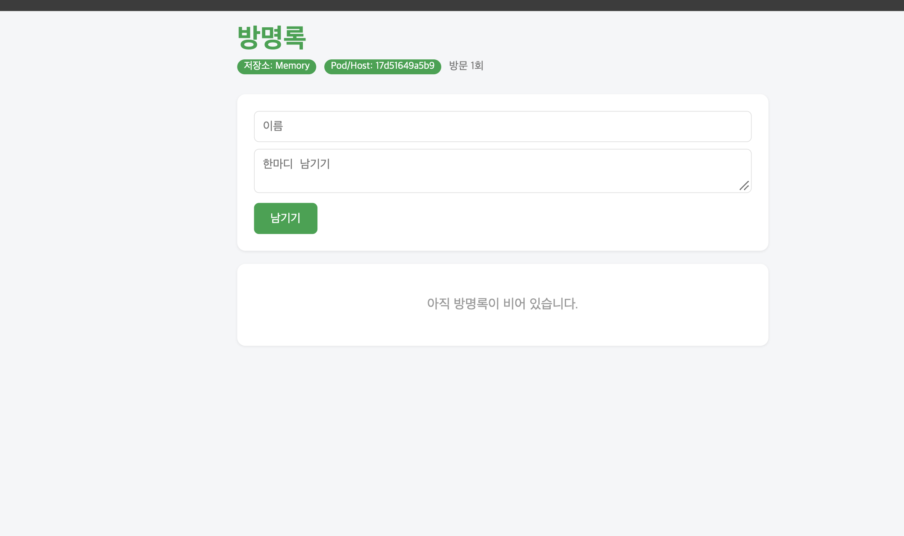

# Week 06

- ghcr.io/seoyoooooni/guestbook:v2

- 

# ---------------------------------------------------------------
# 학생 과제: 아래 각 줄이 무엇을 하는지 주석으로 설명을 달아보세요.
# ---------------------------------------------------------------

FROM python:3.12-slim
// 파이썬 3.12의 가벼운 이미지로 시작

WORKDIR /app
// /app을 작업 디렉터리로 지정

COPY requirements.txt .
//requirements.txt 카피
RUN pip install --no-cache-dir -r requirements.txt
// 설차

COPY . .
// 현재폴더 앱파일을 /app에 복사

RUN useradd -m appuser
// 앱 실행할 사용자 생성
USER appuser
//앱을 appuser 권한으로 실행
ENV APP_TITLE="seoyoooooni InhaTC DevOps 방명록!!!!!" \
    THEME_COLOR="#a922b0"

// 앱 제목과 컬러를 환경변수로 설정

EXPOSE 5000
// 5000포트 사용할거라고 문서화

CMD ["python", "app.py"]
// 컨테이너 시작할때 실행

>
[linux/arm64 1/6] FROM docker.io/library/python:3.12-slim@sha256:f77  0.0s
 => => resolve docker.io/library/python:3.12-slim@sha256:f77ac9e44ae96ef  0.0s
 => [internal] load build context                                         0.0s
 => => transferring context: 297B                                         0.0s
 => CACHED [linux/amd64 2/6] WORKDIR /app                                 0.0s
 => CACHED [linux/amd64 3/6] COPY requirements.txt .                      0.0s
 => CACHED [linux/amd64 4/6] RUN pip install --no-cache-dir -r requireme  0.0s
 => [linux/amd64 5/6] COPY . .                                            0.0s
 => CACHED [linux/arm64 2/6] WORKDIR /app                                 0.0s
 => CACHED [linux/arm64 3/6] COPY requirements.txt .                      0.0s
 => CACHED [linux/arm64 4/6] RUN pip install --no-cache-dir -r requireme  0.0s
 => CACHED [linux/arm64 5/6] COPY . .                                     0.0s
 => CACHED [linux/arm64 6/6] RUN useradd -m appuser                       0.0s
 => [linux/amd64 6/6] RUN useradd -m appuser    
>

| 방법 | 사용 |
|---|---|
| **코드** | 환경변수가 전혀 없을 때 사용 |
| **Dockerfile `ENV`** | 이미지에 기본 설정으로 저장 |
| **`docker run -e`** | 해당 컨테이너를 실행할 때 설정 |